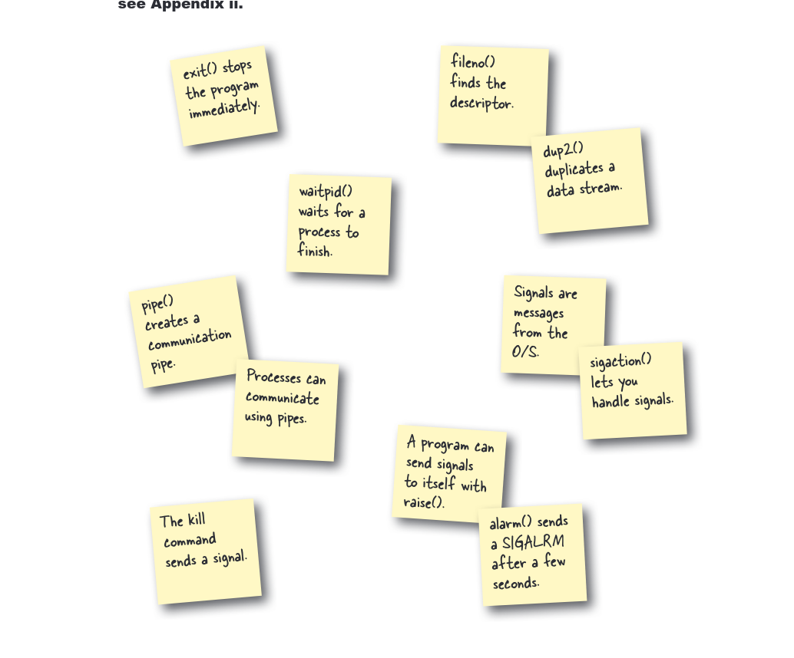

# Bab 10: Proses dan Sinyal

Bab ini membahas pembuatan dan pengelolaan proses, komunikasi antarproses, serta penanganan sinyal di C.

## Contoh

*   `math.c`: Permainan matematika sederhana yang menggunakan sinyal (`SIGALRM`, `SIGINT`) untuk pengatur waktu dan penghentian permainan.
*   `signal.c`: Contoh dasar penangkapan sinyal `SIGINT`.
*   `berita2.c`: Program yang menggunakan `fork` dan `exec` untuk menjalankan skrip eksternal dan `dup2` untuk mengalihkan output.
*   `openBrowser.c`: Mendemonstrasikan penggunaan `pipe` untuk komunikasi antarproses guna membuka URL yang ditemukan dalam output skrip.

