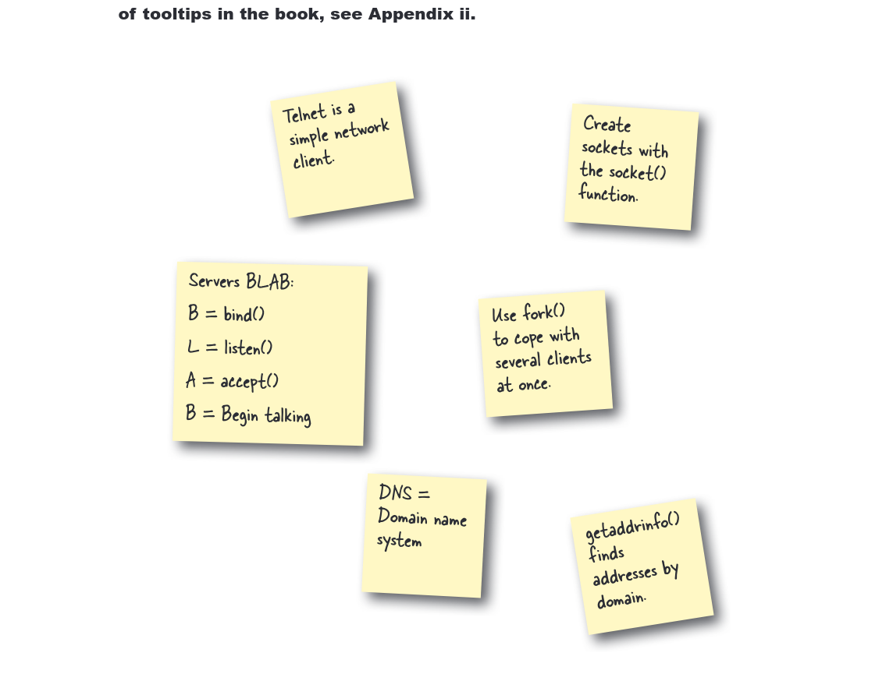

# Pembelajaran Chapter 11

Pada chapter ini, saya mempelajari konsep-konsep penting dalam pemrograman sistem menggunakan bahasa C, meliputi:

*   **Pemrograman Multi-proses dan Multi-threading (`fork.c`, `benchmark.c`)**: Memahami cara membuat proses anak (`fork()`) dan thread (`pthread`) untuk menjalankan tugas secara bersamaan, serta membandingkan kinerja keduanya.
*   **Pemrograman Jaringan (Server TCP, `server.c`, `server2.c`)**: Membuat server TCP sederhana yang dapat menerima koneksi klien, mengirim pesan, dan memproses input. Termasuk implementasi server "nasihat" dan server "tebak-tebakan".
*   **Klien Web Aman (HTTPS, `web_client.c`)**: Mengembangkan klien yang dapat berkomunikasi dengan server web (misalnya Wikipedia) melalui HTTPS, memanfaatkan library OpenSSL untuk koneksi terenkripsi, serta memahami cara mengirim permintaan HTTP GET.

