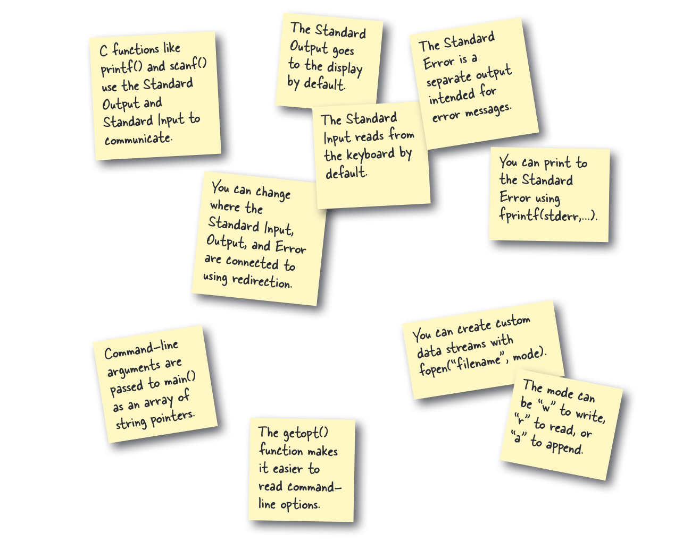

# Ringkasan Chapter 3: Program Baris Perintah

## Proyek-proyek dalam Bab Ini

Berikut adalah program dan konsep yang akan kamu temui:

### 1. Lihat Data GPS di Peta (`geo2json` dan `map.html`)

Proyek ini tunjukkan cara mengubah data mentah jadi visual yang gampang dimengerti.

*   **Tujuan**: Mengubah data lokasi GPS dari file CSV jadi format JavaScript yang bisa ditampilkan di peta.
*   **Cara Pakai**:
    1.  **Kompilasi**: `gcc geo2json.c -o geo2json`
    2.  **Jalankan**: `./geo2json < gpsdata.csv > output.json`
    3.  **Lihat Peta**: Buka `map.html` di browser kamu.

### 2. Saring Data Segitiga Bermuda (`bermuda`)

Program ini cuma akan menunjukkan data yang kamu mau.

*   **Tujuan**: Cari data lokasi GPS yang ada di area Segitiga Bermuda.
*   **Cara Pakai**:
    1.  **Kompilasi**: `gcc bermuda.c -o bermuda`
    2.  **Jalankan**: `./bermuda < spoky.csv` (Hasilnya muncul di terminal).

### 3. Pisahkan Output (`top-secret`)

Latihan ini tunjukkan cara kerja output biasa (`stdout`) dan output error (`stderr`), dan cara pisahin mereka.

*   **Tujuan**: Belajar bedakan `stdout` dan `stderr`, serta cara mengaturnya.
*   **Cara Pakai**:
    1.  **Kompilasi**: `gcc top-secret.c -o top-secret`
    2.  **Jalankan**: `./top-secret < message.txt > secret.txt 2> message2.txt` (Cek `secret.txt` dan `message2.txt` untuk lihat hasilnya).

### 4. Parsing Opsi Baris Perintah (`order_pizza`)

Contoh cara program memproses *flag* (seperti `-t`) dan argumen (seperti `-d "now"`) dari baris perintah.

*   **Tujuan**: Membuat program pesanan pizza yang bisa dikonfigurasi lewat argumen saat dijalankan.
*   **Cara Pakai**:
    1.  **Kompilasi**: `gcc order_pizza.c -o order_pizza`
    2.  **Jalankan**: `./order_pizza -t -d "in 20 mins" pepperoni olives`

### 5. Mengkategorikan Data (`categorize`)

Program ini mengurutkan data dari satu file ke beberapa file output berdasarkan kata kunci.

*   **Tujuan**: Membaca file `spoky.csv` dan membagi isinya ke tiga file berbeda sesuai kata kunci yang dicari.
*   **Cara Pakai**:
    1.  **Kompilasi**: `gcc categorize.c -o categorize`
    2.  **Jalankan**: `./categorize UFO ufos.csv Disappearance dissappearences.csv others.csv` (Cek file `ufos.csv`, `dissappearences.csv`, dan `others.csv`).

### 6. Dasar-dasar Pointer (`ship.c`)

Ini contoh sederhana buat pahami pointer.

*   **Tujuan**: Lihat gimana fungsi bisa ganti nilai variabel yang ada di luar fungsi itu, pakai pointer.
*   **Isi Proyek**: `ship.c` adalah program kecil yang pakai fungsi `go_south_east()` dengan pointer buat ubah posisi kapal.

## Konsep Kunci yang Dipelajari
*   **Input/Output Standar**: Baca dari `stdin`, tulis ke `stdout` dan `stderr`.
*   **Alihkan I/O**: Pakai simbol `<`, `>`, dan `2>` di baris perintah buat kontrol input dan output.
*   **Pipeline**: Gabung beberapa program supaya output satu program jadi input program lain.
*   **Filter**: Bikin program yang baca data dan cuma pilih data tertentu sesuai kriteria.
*   **Argumen Baris Perintah**: Membaca dan memproses argumen (`argc`, `argv`) dan opsi (`getopt`).
*   **Format Teks**: Pakai `printf` buat bikin tulisan yang rapi.
*   **Pointer**: Cara kerja pointer buat ngirim alamat variabel ke fungsi.