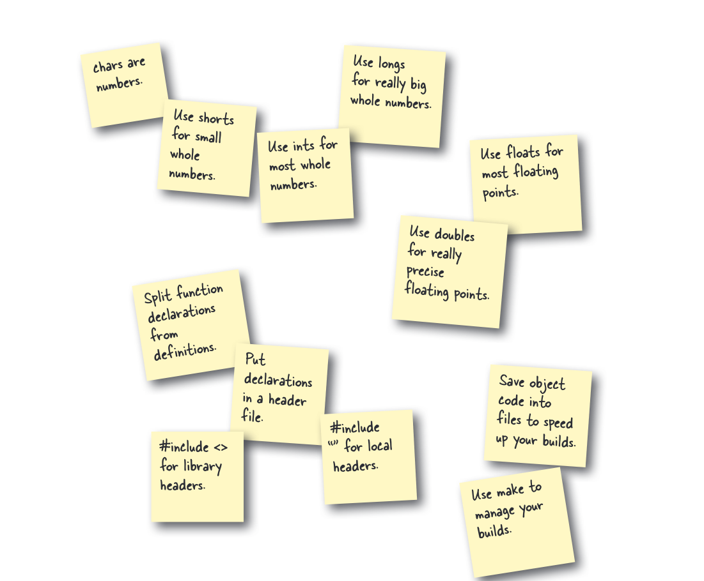
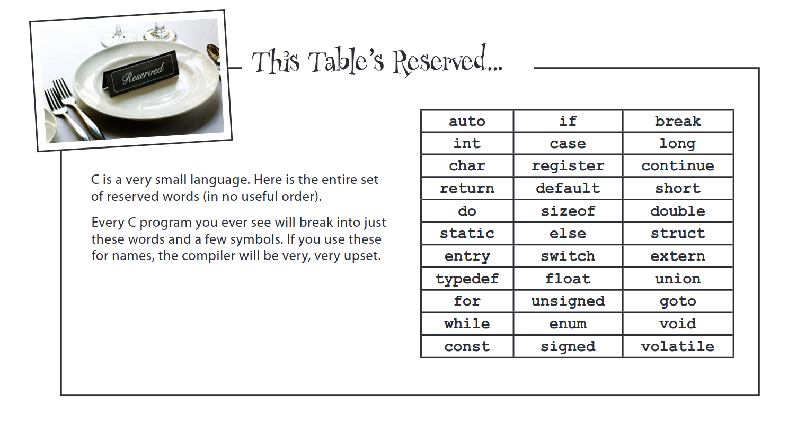

# Pembelajaran Chapter 4

Berikut adalah poin-poin utama yang dipelajari di Chapter 4:

## 1. Pemrograman Modular di C
- Memisahkan deklarasi fungsi dari definisinya.
- Menggunakan file header (`.h`) untuk deklarasi.
- `#include <>` untuk header pustaka, `#include ""` untuk header lokal.
- Menggunakan `make` untuk mengelola proses build.
- 

## 2. Tipe Data C
- `char`: untuk karakter/angka kecil.
- `short`: untuk bilangan bulat kecil.
- `int`: untuk sebagian besar bilangan bulat.
- `long`: untuk bilangan bulat sangat besar.
- `float`: untuk sebagian besar angka floating-point.
- `double`: untuk angka floating-point yang lebih presisi.

## 3. Input/Output & Alur Kontrol Dasar
- Membaca input dengan `fgets()` dan `scanf()`.
- Mencetak output dengan `printf()`.
- Penggunaan loop `while`.

## 4. Operasi Bitwise
- Mengenal operasi XOR (`^`) untuk aplikasi seperti enkripsi sederhana.

## 5. Kata Kunci Cadangan C
- Memahami daftar kata kunci yang dicadangkan dalam bahasa C yang tidak dapat digunakan sebagai nama variabel atau fungsi.
- 
