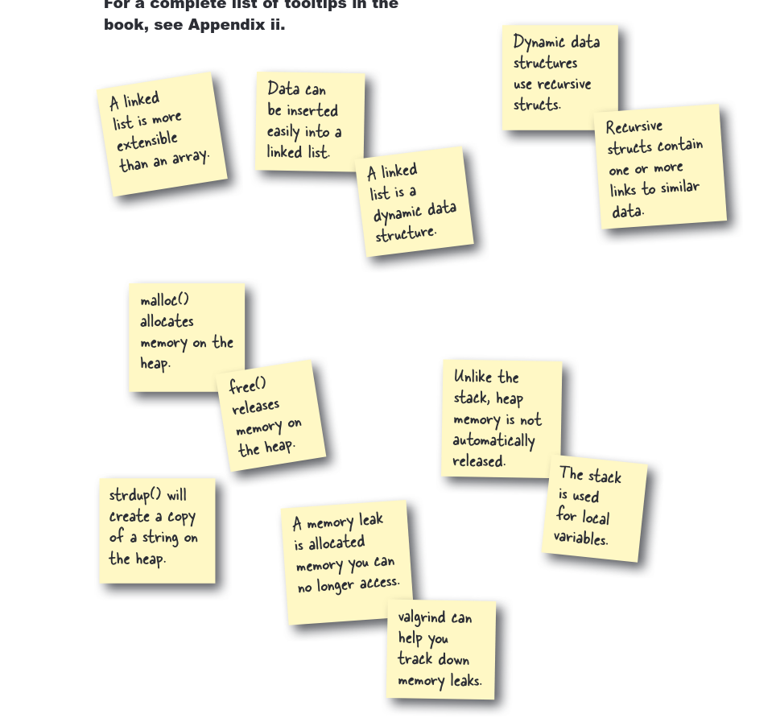

**Bab 6: Dasar-Dasar Pemrograman C**

Materi yang dipelajari:
- Struktur data (`struct`, `typedef`)
- Alokasi memori dinamis (`malloc`, `free`)
- Linked list (contoh `island.c`)
- Manipulasi string
- Pohon keputusan sederhana (contoh `spesies.c`)

