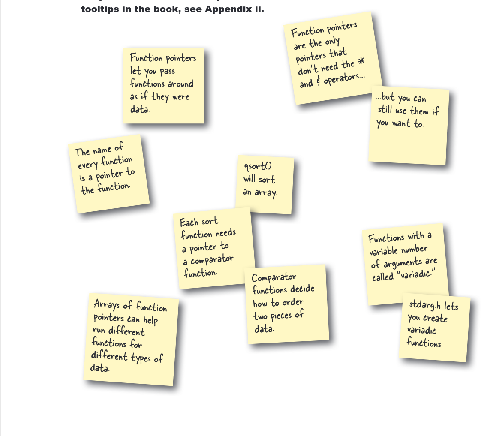

Bab 7 ini mencakup beberapa konsep pemrograman C tingkat lanjut:

*   **Enum & Struct:** Digunakan untuk mendefinisikan tipe data kustom.
*   **Function Pointers:** Memungkinkan pemanggilan fungsi secara dinamis dan implementasi *callback*.
*   **Fungsi Pustaka Standar:** Contoh penggunaan `qsort` untuk pengurutan.
*   **Variadic Functions:** Fungsi yang dapat menerima jumlah argumen yang bervariasi.

