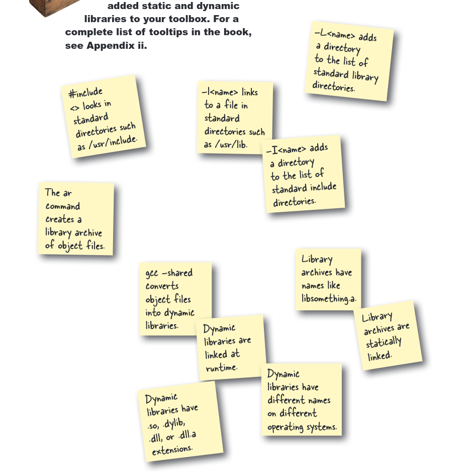

# Chapter 8: Belajar Modul C

Bab ini berfokus pada pembuatan dan pengujian modul C terpisah, serta pemahaman tentang dynamic linking dan static linking melalui penggunaan pustaka statis dan dinamis.

## Modul yang Dikerjakan:

*   **Checksum**: Fungsi untuk menghitung nilai checksum dari sebuah string.
*   **Enkripsi/Dekripsi**: Fungsi untuk mengenkripsi dan mendekripsi string.
*   **Kalkulasi Kalori (hfcal)**: Fungsi untuk menghitung dan menampilkan pembakaran kalori berdasarkan berat dan jarak.

## Pengujian:

`test_code.c` menunjukkan penggunaan modul checksum dan enkripsi/dekripsi. Ini menguji proses enkripsi dan dekripsi pesan serta memverifikasi checksum sebelum dan sesudah perubahan.

