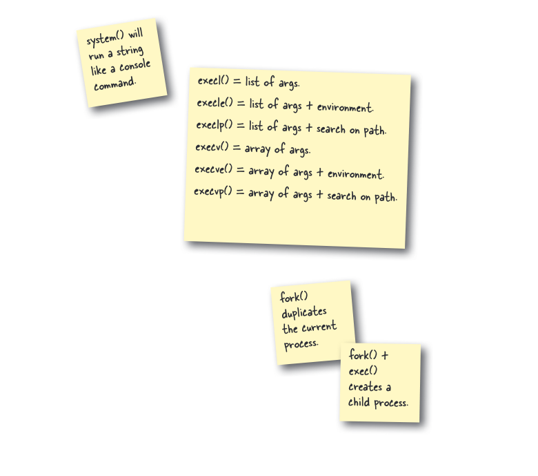

# Praktik System Call di Head First C Chapter 9

Proyek ini adalah praktik penggunaan beberapa *system call* (syscall) penting di C:

1.  **`fork()`**: Membuat proses anak (child process).
2.  **`execle()`**: Mengganti program yang sedang berjalan di sebuah proses dengan program lain (`rssgossip.py`). Syscall ini juga memungkinkan untuk meneruskan variabel lingkungan (*environment variables*) baru ke program tersebut.
3.  **`waitpid()`**: Menunggu proses anak selesai sebelum melanjutkan eksekusi di proses induk (*parent process*).

Program `berita.c` mendemonstrasikan bagaimana sebuah program C dapat menjalankan skrip eksternal (Python) dengan argumen dan variabel lingkungan yang berbeda untuk setiap eksekusi.

## Screenshot

